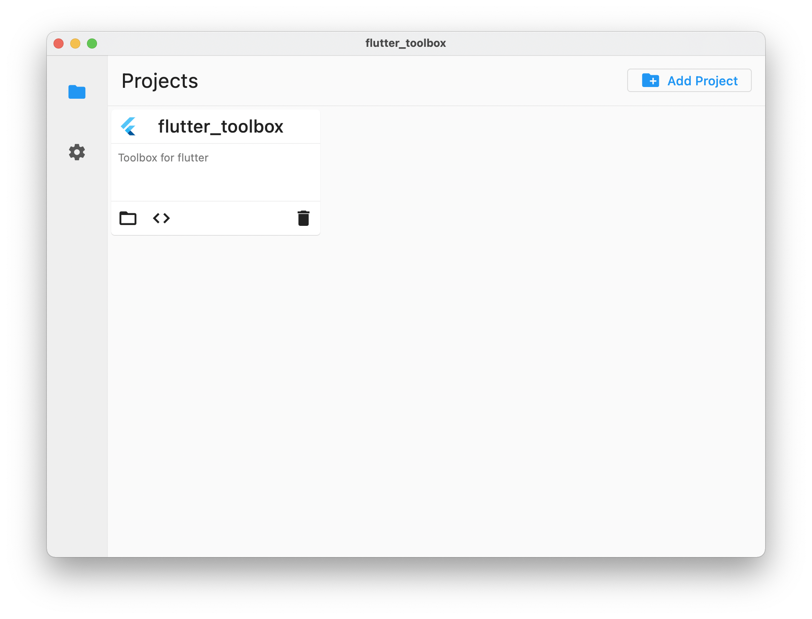

# flutter_toolbox

Toolbox for Flutter development

Project management

Check local SDK information  
Change Pub server for dependency version fetching  
Read Flutter / Dart changelogs  
Change Flutter platform config

Check project dependency updates, change it with one click

